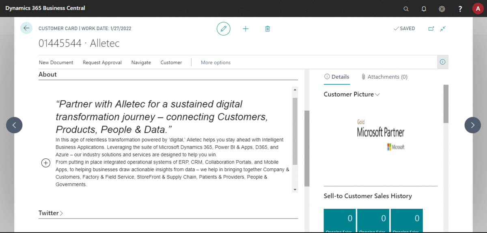

# Sample Project on How to use ReactJS in Control Add-ins 
It has the following projects 

## Projects
* app - AL Project which contains Control Add-in
* react-app - React Application with contains Rich Content Editor React Component

## Learn more
You can find details at [msnJournals.com](https://msnJournals.com).

## Code in Action
