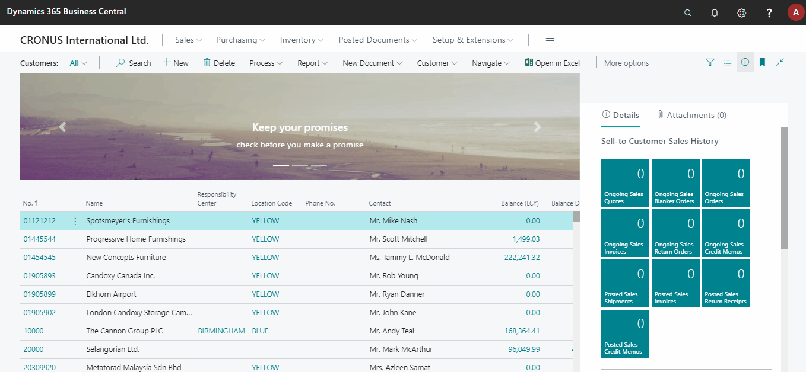

# Why to use Control Add-ins (Overview with a simple Example)

## Introduction

`Control Add-in` is a special type of object in Business Central to create `User Control`. In other words `Control Add-in` (User Control) is a web component developed using `JavaScript`, `HTML` and `CSS` that can interact with Business Central. You need `User Control` when you do not have the required control available in standard Business Central. Also you need `User Control` when you want to simplify User Interface (UI) for your Business Central User.

## Skills Required

You need to have the following skills to develop `Control Add-ins`:

	• AL - Good
	• HTML - Basic
	• CSS - Basic
	• JavaScript - Basic

If you are smart enough, you just need to know how to copy paste :)

If you are new to [HTML](https://www.w3schools.com/html/), [CSS](https://www.w3schools.com/css/), and [JavaScript](https://www.w3schools.com/js/), in my opinion [w3shools.com](https://www.w3schools.com/html/) is the best place to learn quickly.

## Dos and don'ts

You should try to create reusable `Control Add-ins`, you should avoid hard-coding. You should be able to use the same `User Control` in more than one page.

For example:

* A 'Map Control' can be used, in Customer, Vendor, Bank, Location pages. 
* A 'Status Indicator Control' can be used in Sales, Purchase, and Service Orders, may also be in Bank Reconciliation page. 

In the example given below, if you hard-code slides data in `Control Add-in` instead of sending as a parameter, you can not use this in other pages.

## No more talking - Let's create a Control Add-in

We don’t need to develop `Control Add-in` from scratch. There are tons of open source web components available on the web. We just need to understand the component and convert it to `Control Add-in`.

We are creating [Carousel](https://getbootstrap.com/docs/4.5/components/carousel/#with-captions) control using the [Bootstrap](https://getbootstrap.com/) component.

We need to use the following resources for any bootstrap component:

[CSS](https://getbootstrap.com/docs/4.5/getting-started/introduction/#css)
```html
<link rel="stylesheet" href="https://stackpath.bootstrapcdn.com/bootstrap/4.5.0/css/bootstrap.min.css" integrity="sha384-9aIt2nRpC12Uk9gS9baDl411NQApFmC26EwAOH8WgZl5MYYxFfc+NcPb1dKGj7Sk" crossorigin="anonymous">
```

[JS](https://getbootstrap.com/docs/4.5/getting-started/introduction/#js)
```html
<script src="https://code.jquery.com/jquery-3.5.1.slim.min.js" integrity="sha384-DfXdz2htPH0lsSSs5nCTpuj/zy4C+OGpamoFVy38MVBnE+IbbVYUew+OrCXaRkfj" crossorigin="anonymous"></script>
<script src="https://cdn.jsdelivr.net/npm/popper.js@1.16.0/dist/umd/popper.min.js" integrity="sha384-Q6E9RHvbIyZFJoft+2mJbHaEWldlvI9IOYy5n3zV9zzTtmI3UksdQRVvoxMfooAo" crossorigin="anonymous"></script>
<script src="https://stackpath.bootstrapcdn.com/bootstrap/4.5.0/js/bootstrap.min.js" integrity="sha384-OgVRvuATP1z7JjHLkuOU7Xw704+h835Lr+6QL9UvYjZE3Ipu6Tp75j7Bh/kR0JKI" crossorigin="anonymous"></script>
```

[HTML](https://getbootstrap.com/docs/4.5/components/carousel/#with-captions)
```html
<div id="carouselExampleCaptions" class="carousel slide" data-ride="carousel">
  <ol class="carousel-indicators">
    <li data-target="#carouselExampleCaptions" data-slide-to="0" class="active"></li>
    <li data-target="#carouselExampleCaptions" data-slide-to="1"></li>
    <li data-target="#carouselExampleCaptions" data-slide-to="2"></li>
  </ol>
  <div class="carousel-inner">
    <div class="carousel-item active">
      
      <div class="carousel-caption d-none d-md-block">
        <h5>First slide label</h5>
        <p>Nulla vitae elit libero, a pharetra augue mollis interdum.</p>
      </div>
    </div>
    <div class="carousel-item">
      
      <div class="carousel-caption d-none d-md-block">
        <h5>Second slide label</h5>
        <p>Lorem ipsum dolor sit amet, consectetur adipiscing elit.</p>
      </div>
    </div>
    <div class="carousel-item">
      
      <div class="carousel-caption d-none d-md-block">
        <h5>Third slide label</h5>
        <p>Praesent commodo cursus magna, vel scelerisque nisl consectetur.</p>
      </div>
    </div>
  </div>
  <a class="carousel-control-prev" href="#carouselExampleCaptions" role="button" data-slide="prev">
    <span class="carousel-control-prev-icon" aria-hidden="true"></span>
    <span class="sr-only">Previous</span>
  </a>
  <a class="carousel-control-next" href="#carouselExampleCaptions" role="button" data-slide="next">
    <span class="carousel-control-next-icon" aria-hidden="true"></span>
    <span class="sr-only">Next</span>
  </a>
</div>
```

### Control Add-in Object (CarouselControl.controladdin.al)
This `Carousel Control` has `OnStartup` trigger, which will be triggered once the `User Control` is loaded. 

`SetCarouselData` is a function that will send the slides data to `Control Add-in`. 

```
controladdin "Carousel Control"
{
    HorizontalStretch = true;
    RequestedHeight = 200;

    // JS files required for Bootstrap
    Scripts = 'https://code.jquery.com/jquery-3.5.1.slim.min.js',
        'https://cdn.jsdelivr.net/npm/popper.js@1.16.0/dist/umd/popper.min.js',
        'https://stackpath.bootstrapcdn.com/bootstrap/4.5.0/js/bootstrap.min.js';

    StartupScript = 'src/startup.js';

    // Bootstrap css
    StyleSheets = 'https://stackpath.bootstrapcdn.com/bootstrap/4.5.0/css/bootstrap.min.css';

    procedure SetCarouselData(Data: JsonObject);
    event OnStartup();
}
```

### Startup Javascript file (startup.js)
This `JavaScript` file will be loaded once the `User Control` is ready. We are invoking `OnStartup` trigger so that the hosting page can receive the event and send the data back to the `User Control`.

```javascript
Microsoft.Dynamics.NAV.InvokeExtensibilityMethod('OnStartup')

function carouselIndicators(slides) {
    var indicators = [];
    for (var i = 0; i < slides.length; i++) {
        var cssClass = i === 0 ? 'class="active"' : '';
        indicators.push(`<li data-target="#carouselExampleCaptions" data-slide-to="${i}" ${cssClass}></li>`);
    }

    return `<ol class="carousel-indicators">${indicators.join('')}</ol>`;
}

function carouselItems(slides) {
    var carouselItems = [];
    for (var i = 0; i < slides.length; i++) {
        var slide = slides[i];
        var cssClass = i === 0 ? 'active' : '';

        carouselItems.push(`
<div class="carousel-item ${cssClass}">
    
        <div class="carousel-caption d-none d-md-block">
        <h5>${slide.title}</h5>
        <p>${slide.description}</p>
    </div>
</div>`);
    }

    return `<div class="carousel-inner">${carouselItems.join('')}</div>`;
}

function carouselMarkup(data) {
    return `
<div id="carouselExampleCaptions" class="carousel slide" data-ride="carousel">
    ${carouselIndicators(data.slides)}
    ${carouselItems(data.slides)}
    <a class="carousel-control-prev" href="#carouselExampleCaptions" role="button" data-slide="prev">
        <span class="carousel-control-prev-icon" aria-hidden="true"></span>
        <span class="sr-only">Previous</span>
    </a>
    <a class="carousel-control-next" href="#carouselExampleCaptions" role="button" data-slide="next">
        <span class="carousel-control-next-icon" aria-hidden="true"></span>
        <span class="sr-only">Next</span>
    </a>
</div>`;
}

window.SetCarouselData = function (data) {
    try {
        var markup = carouselMarkup(data);
        document.getElementById('controlAddIn').innerHTML = markup;
        $('#carouselExampleCaptions').carousel();
        console.log(markup);
    } catch (err) {
        console.log(err);
    }
}
```

### Page (CustomerListExt.PageExt.al)
We are extending the `Customers` page to add `Carousel Control` at the top of the customers list. When the `OnStartup` event is triggered, we are preparing the `Json Object` that contains the slides data and sending it to `Carousel Control`.

```
pageextension 50100 CustomerListExt extends "Customer List"
{
    layout
    {
        addbefore(Control1)
        {
            usercontrol(Carousel; "Carousel Control")
            {
                trigger OnStartup()
                var
                    JObject: JsonObject;
                    Slides: JsonArray;
                begin
                    Slides.Add(AddSlide('Keep your promises', 'check before you make a promise', '//unsplash.it/1024/200'));
                    Slides.Add(AddSlide('Never forget', 'always register your conversations to ensure you follow-up promptly', '//unsplash.it/1025/200'));
                    Slides.Add(AddSlide('Qualify', 'be picky about which opportunities to spend time on', '//unsplash.it/1024/201'));
                    JObject.Add('slides', Slides);
                    CurrPage.Carousel.SetCarouselData(JObject);
                end;
            }
        }
    }

    local procedure AddSlide(Title: Text; Description: Text; Image: Text): JsonObject
    var
        Slide: JsonObject;
    begin
        Slide.Add('title', Title);
        Slide.Add('description', Description);
        Slide.Add('image', Image);
        exit(Slide);
    end;
}
```

## Carousel Control in Action


## Conclusion

If we think about it, The Users don't actually need training to work on portals just because they are intuitive. But in the case of Business Applications, we definitely need to provide training to the Business Users, where they already know their business more than us. Isn't it funny! It is simply because they are not provided proper and intuitive User Interfaces. I think we should try to provide proper UI to the Users so that it is convenient for their use. Proper UI means that we should not restrict ourself only to the available controls. Where ever required, we should definitely try to create `Control Add-ins` / `User Controls` for better user experience.

Use `Control Add-ins` - Help customers!!

You can download the source code from [Github]()

Thank You